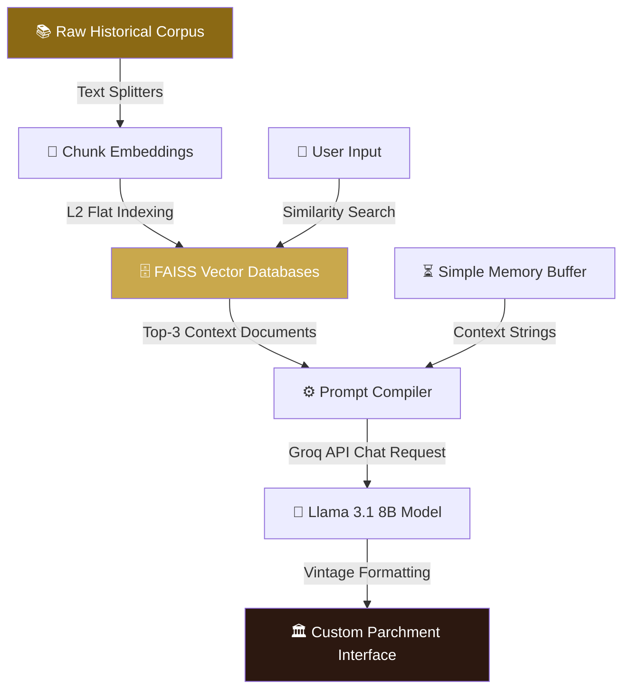

<div align="center">

# 🏛️ Echoes of History — The Historical Persona Museum

### 🌐 **[Step Into the Past & Chat with the Echoes of History](https://ec-project.streamlit.app/)**

[](https://git.io/typing-svg)


<br/>

[](https://ec-project.streamlit.app/)
[](https://github.com/mayank-goyal09/echoes-of-history/stargazers)
[](https://github.com/mayank-goyal09/echoes-of-history/network)

<br/>

### **Retrieval-Augmented Generation (RAG) meets Historical Roleplay.**  
### **Engage in grounded conversations bounded strictly by the knowledge eras of the past.** 🛰️

</div>

---

## ⚡ **THE HISTORICAL ENGINE AT A GLANCE**

### 🎯 **What Echoes of History Does**
Echoes of History is a **vintage-themed full-stack AI roleplaying application** that allows you to summon historical figures from the archives. Using **FAISS Vector Databases** loaded with authentic writings, diaries, and transcripts, it grounds an LLM's responses using dense vector retrieval, maintaining strict historical accuracy and character limits.

**Core Pipeline Pillars:**
* 📚 **Dense Vector Ingestion** → Compiles raw historical text files into local, high-speed FAISS vector indexes.
* 🛡️ **Era Boundary Enforcement** → Prevents personas from acknowledging modern inventions or future events beyond their cutoff years.
* ⏳ **Window-Based Memory** → Tracks conversational turns without bloating prompts, preserving historical context.
* 🔬 **Dynamic Soul Registry (The Lab)** → Discover and register new custom personas on the fly by simply adding a source text folder.
* 📜 **Vintage Parchment UI** → Premium custom-styled Streamlit CSS interface with typography, animations, and micro-interactions.

### 🏛️ **Persona Soul Registry Grid**

| Persona | Setting / Era | Key Tone & Style | Cutoff Year | Icon |
| :--- | :--- | :--- | :---: | :---: |
| **Abraham Lincoln** | 19th Century America | Weary, humble, resolute. Uses "four score", "Union". | **1865** | 🎩 |
| **Nikola Tesla** | Late 19th/Early 20th Cent. | Eccentric, visionary, highly scientific. | **1943** | ⚡ |
| **Mahatma Gandhi** | 20th Century India | Calm, philosophical, peaceful, resolute. | **1948** | 🕊️ |
| **Donald Trump** | 21st Century America | Bold, colloquial, direct, enthusiastic. | **2026** | 🦅 |
| **Grandfather** | Personal Memories | Reminiscent, nostalgic, warm, wise. | **2026** | 👴 |

---

## 🛠️ **TECHNOLOGY & ARCHITECTURE STACK**

<div align="center">


</div>

| **Category** | **Technologies** | **Role & Implementation** |
|:------------:|:-----------------|:--------------------------|
| 🐍 **Core Logic** | Python 3.9+ / LangChain | Manages chat history memory, system instructions, and vector indexing. |
| 🧠 **LLM Engine** | ChatGroq / Llama-3.1-8b-instant | Ultra-fast token generation powering realistic dialogues and JSON extraction. |
| 🗄️ **Retrieval RAG** | FAISS / HuggingFaceEmbeddings | local flat L2 indexing of historical records using `all-MiniLM-L6-v2`. |
| 🎨 **UI Theme** | Streamlit / Custom CSS | Translucent vintage parchment design, custom font faces, and dynamic transitions. |

---

## 🔬 **SYSTEM ARCHITECTURE FLOW**



### **Technical Breakdown:**

#### 1. Flat L2 FAISS Ingestion 🗄️
Rather than querying heavy cloud vector databases, the engine saves and loads local FAISS indices. Given a query vector $\mathbf{q}$ and database vectors $\mathbf{v}_i$, FAISS performs a fast Euclidean distance query:
$$d(\mathbf{q}, \mathbf{v}_i) = \|\mathbf{q} - \mathbf{v}_i\|_2$$
It returns the top $k=3$ closest context documents to feed directly into the prompt context.

#### 2. Universal Soul Prompt Template ⚖️
Each persona is instantiated through a strict prompt structure:
$$\text{Prompt} = \mathbf{f}(\text{Persona Vitals}, \text{Retrieved Context}, \text{Memory Buffer}, \text{User Query})$$
This template forces the model to ignore future knowledge (e.g. Tesla refusing to acknowledge cars or smartphones) and respond with era-specific vocabulary.

#### 3. Streamlit Watcher Bypass ⚙️
To prevent issues when running local GNN/Transformers libraries in Streamlit Cloud, we override Streamlit's default file watcher to `none` via `.streamlit/config.toml`, bypassing dependency scans and speeding up app load times.

---

## 📂 **PROJECT BLUEPRINT**

```text
🏛️ echoes-of-history/
│
├── 📂 .streamlit/
│   └── config.toml             # Bypasses local file watchers on Streamlit Cloud
│
├── 📂 faiss_db/                # Serialized FAISS Vector Stores per Persona
│   ├── 📂 Abraham_Lincoln/     
│   ├── 📂 Donald_Trump/        
│   ├── 📂 Grandfather/         
│   ├── 📂 Mahatma_Gandhi/      
│   └── 📂 Nikola_Tesla/        
│
├── 📂 source_data/             # Raw Text Corpora for Historical Documents
│   ├── 📂 Abraham_Lincoln/     
│   └── ...                     
│
├── 📜 app.py                   # Custom-Styled Parchment UI Streamlit Entrypoint
├── ⚙️ engine.py                 # RAG Langchain FAISS Engine with SimpleMemory
├── 🧬 migrate_to_faiss.py      # Script to convert raw source texts to FAISS vector DBs
├── 📋 persona_config.json      # Dynamic Registry defining Era, Tone, and Cutoff Vitals
├── 📦 requirements.txt         # Project Dependencies
└── 📖 README.md                # You are here! 🎉
```

---

## 🚀 **GETTING STARTED & LAUNCH GUIDE**

### **Step 1: Clone the Repository** 📥
```bash
git clone https://github.com/mayank-goyal09/echoes-of-history.git
cd echoes-of-history
```

### **Step 2: Create a Clean Environment & Install Dependencies** 📦
```bash
python -m venv venv
source venv/bin/activate   # On Windows: venv\Scripts\activate
pip install -r requirements.txt
```

### **Step 3: Setup Environment Secrets** 🔑
Create a `.env` file at the root of the project:
```env
GROQ_API_KEY=your_groq_api_key_here
```

### **Step 4: Launch the Museum locally** 💻
```bash
streamlit run app.py
```
Open your browser and explore the past!
👉 **`http://localhost:8501`**

---

## 🔮 **FUTURE UPGRADES**
- [ ] 🎙️ **TTS Era Voices**: Convert historical figures' text replies into voice lines using vintage radio effect filters.
- [ ] 📜 **Parchment PDF Exporter**: Allow compliance officers and students to download their historical chats formatted as scanned vintage documents.
- [ ] 📂 **Dynamic OCR Document Ingester**: Drag and drop historic scans to compile vectors automatically.

---

## 👨‍💻 **CONNECT WITH ME**

<div align="center">

[](https://github.com/mayank-goyal09)
[](https://www.linkedin.com/in/mayank-goyal-4b8756363/)
[](https://mayank-goyal09.github.io/)

**Mayank Goyal**  
🧠 RAG & Deep Learning Developer | 📊 Historical AI Architect | ⚙️ Full-Stack Engineer

</div>

---

<div align="center">

### 🏛️ **Built with ❤️ by Mayank Goyal**

*"Converse with the past, preserve the future."* 🏛️📜🕊️


</div>
